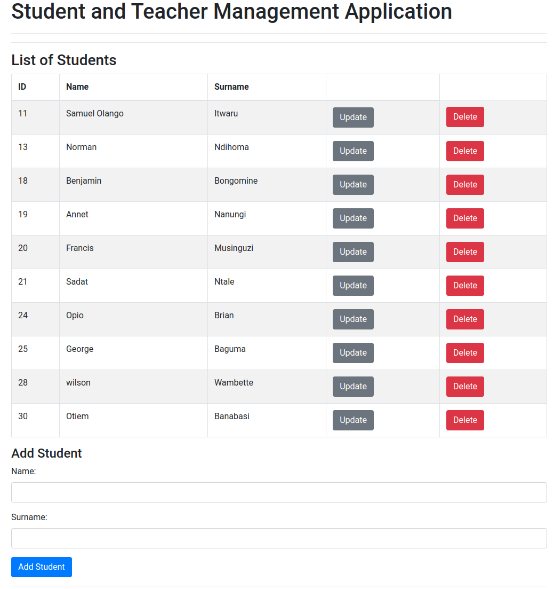
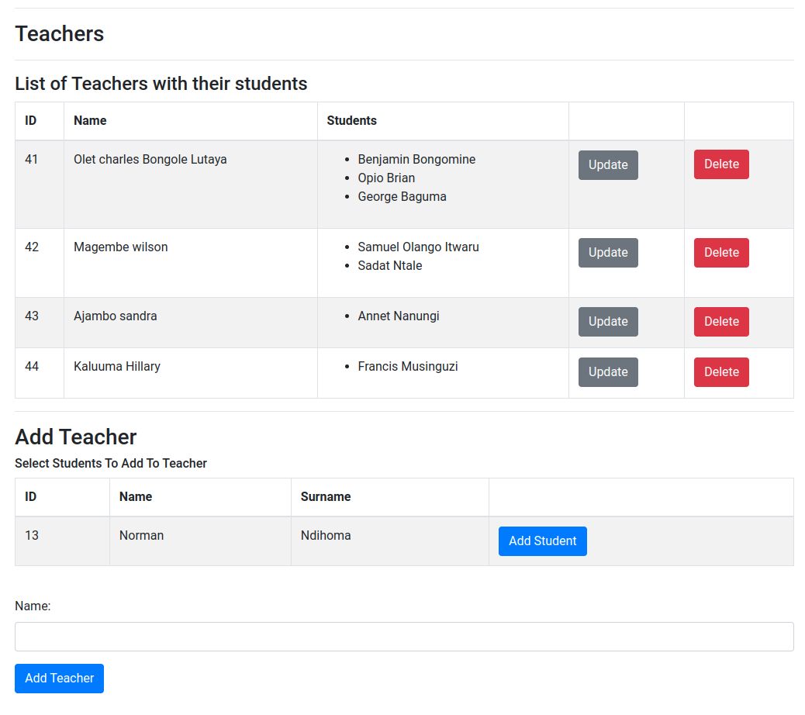
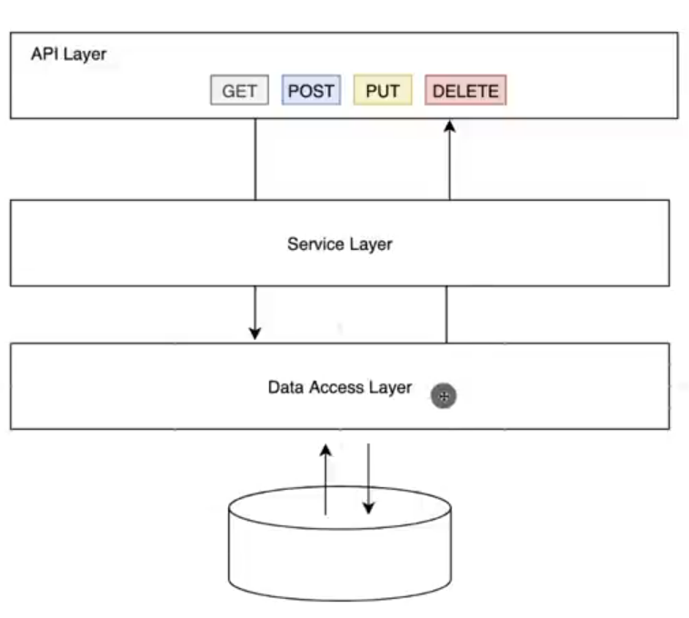

# Student-Teacher Management Application

The Student-Teacher Management Application is a web-based application built using Spring Boot, Spring Data, and jQuery. It provides functionality to manage students and teachers in a database. Students and teachers are stored in a MySQL database, and the application communicates with the server via a REST API.
## Student section of the Application


## Teacher section of the Application


## Application Description

The Student-Teacher Management Application allows you to perform the following operations:

- Create, read, update, and delete students
- Create, read, update, and delete teachers
- Associate students with teachers

## Application Architectural Pattern


## Database Setup

To set up the database for the application, follow these steps:

1. Install MySQL i.e (5.7) if you haven't already.
2. Create a new database in MySQL called **myDB**.
3. Update the database configuration in the `application.properties` file located in the `src/main/resources` directory with your MySQL database connection details. The file should have the following details as show below:
```
    spring.datasource.url=jdbc:mysql://localhost:3306/myDB
    spring.datasource.username=your-username
    spring.datasource.password=your-password
```
## Database Models

The application uses two main models:

### Student

- id (Long): Unique identifier for the student.
- name (String): Student's first name.
- surname (String): Student's last name.

### Teacher

- id (Long): Unique identifier for the teacher.
- name (String): Teacher's name.
- students (List<Student>): List of students associated with the teacher.

## Create the above data models as tables in the mysql DB i.e myDB
Using the following SQL statements to create them.
```
CREATE TABLE students (
    id BIGINT PRIMARY KEY AUTO_INCREMENT,
    name VARCHAR(255) NOT NULL,   
    surname VARCHAR(255) NOT NULL 
);

CREATE TABLE teachers (
    id BIGINT PRIMARY KEY AUTO_INCREMENT,
    name VARCHAR(255) NOT NULL 
);

CREATE TABLE teacher_student (
  teacher_id BIGINT NOT NULL,
  student_id BIGINT NOT NULL,
  PRIMARY KEY (teacher_id, student_id),
  FOREIGN KEY (teacher_id) REFERENCES teachers(id),
  FOREIGN KEY (student_id) REFERENCES students(id)
);
```

## Note:
The teacher_student table will be used as a join table to cater for the one to many relationship between the student and teacher entity. It has two columns: teacher_id and student_id, both of which are foreign keys to the teachers and students tables, respectively. The PRIMARY KEY constraint ensures that each combination of teacher_id and student_id is unique.

## Database Dump

A database dump file is available at `database_dump.sql`. You can import this file into your MySQL database to create the required tables and sample data using the following command below:
```
mysql -u <username> -p <database_name> < database_dump.sql

```

## REST API Endpoints

The following endpoints are available for the Student and Teacher resources:

### Student Endpoints

- `GET http://localhost:8000/api/v1/students`: Get all students.
- `GET http://localhost:8000/api/v1/students/{id}`: Get a student by ID.
- `POST http://localhost:8000/api/v1/students`: Create a new student.
- `PUT http://localhost:8000/api/v1/students/{id}`: Update an existing student.
- `DELETE http://localhost:8000/api/v1/students/{id}`: Delete a student.

### Teacher Endpoints

- `GET http://localhost:8000/api/v1/teachers`: Get all teachers.
- `GET http://localhost:8000/api/v1/teachers/{id}`: Get a teacher by ID.
- `POST http://localhost:8000/api/v1/teachers`: Create a new teacher.
- `PUT http://localhost:8000/api/v1/teachers/{id}`: Update an existing teacher.
- `DELETE http://localhost:8000/api/v1/teachers/{id}`: Delete a teacher.

## Testing Framework

The unit tests for the application are written using JUnit and Mockito. These tests are located in the `src/test/java/com/Student_Teacher/ManagementApplication/controller` directory.

To run the tests, you can use the following command:
```
    mvn test
```
Otherwise  you can use IntelliJ IDEA to run the tests by using the following steps:

1. Locate the test class you want to run in the Project view. Test classes are typically placed in  the src/test/java directory.
2. Right-click on the test class and select "Run <TestClassName>". Alternatively, you can navigate to the test class and press the keyboard shortcut Ctrl+Shift+F10 (Windows/Linux) or Cmd+Shift+F10 (macOS) to run the test class.

IntelliJ IDEA will execute the tests and display the test results in the "Run" tool window. You can view the test results, including the number of tests passed, failed, and skipped, as well as any error or failure details.

## Project dependencies
- org.springframework.boot:spring-boot-starter-data-jpa 3.0.6
- org.springframework.boot:spring-boot-starter-test 3.0.6
- org.springframework.boot:spring-boot-starter-thymeleaf 3.0.6
- org.springframework.boot:spring-boot-starter-web 3.0.6
- mysql-connector-j 8.0.33
- java 17
